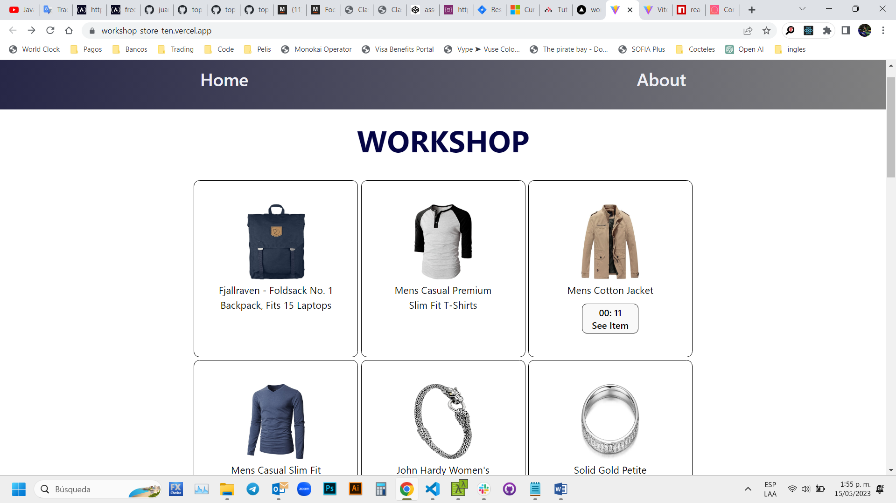

# Make It Real - Worshop Store
## This is a solution to the *workshop srpint 1* mission of the Make It Real course.

## The challenge
create a React Project

## Vercel page
http://workshop-store-ten.vercel.app/

## Screenshot

## My process
### Built with
- Semantic markup using vscode editor
- React code using vite in vs code
- CSS properties in a stylesheet file
- React Router library

## What I learned
I practice html, css, react and js

## Author
Juan David Peña  
github - @juandape  
email - juandavidp76@hotmail.com  

## Acknowledgments
Thanks to Make it Real to show me a path to become a better programmer